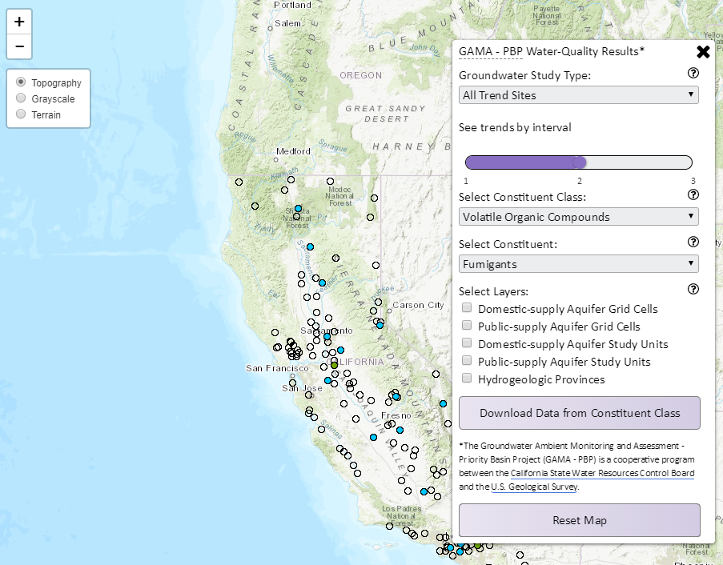

# GAMA - Priority Basin Project Water-Quality Results



This is a [vue](vuejs.org) project that generates a static page from Vue components. There are two environments, defined in the build/ folder and run from the script defined in package.json. run ```npm run dev``` for the dev environment, which is served at localhost:8080 and hot reloads, or ```npm run build``` to build the static files in the dist/ folder.

The most important file is ~src/assets/listOfParameters.json 
This file determines how the menu works, what will show up in the popup, and the units shown in the legend. If the parameter has trends layers, then the parameter must have a "trends" key with an array of the trend layer values. The "StatusColumns" key tells the map which columns in the data to find the categorization or the number of detects.

The app's structure beings in src/app.vue. Global libraries are defined in src/main.js, including an Es6Promise polyfill to make Promises work with IE. The app.vue file coordinates passing data between the map, the menu, and the legend components. It also registers the mixins/toggle.vue component, which watches the size of the screen and will toggle the menu and legend to smaller sizes should the screen fall below a threshold number of pixels.

The components of the app are all within the components/ folder. The mapDiv.vue component is the most complicated component, clearing the map's layers and calling mixin functions depending on what values have been selected in the menu. 

The requests to the arcServer are managed in the file mixins/getData.vue. This file defines the possible endpoints and returns esri.dynamicMapLayers to the mapDiv component. The mapDiv component then manages adding and removing the layers from L.featureGroups.

Functions that build the popup content are housed in mixins/getTrendPopup and mixins/getParamPopup and mixins/buildTrendGraph

User Stories:
- User selects "Public trends sites", "VOCs", and "Trihalomethanes". Because changing this.param then changes this.trend, this.trend will be the final variable that is changed. The map div must avoid calling this.importParam when this.type === 0 or 4 and this.param.hasOwnProperty('trends') (line 94, mapDiv.vue). The layer is imported on line 81 of mapDiv.vue

- User selects "VOCs", "Trihalomethanes", and "Public trends sites". This.type is the final variable to be changed on the menu, but changing it toggles a change in this.trend. The map div must avoid calling this.setLayerDefs on the constituent layer if this.type === 0 or 4 and this.param.hasOwnProperty('trends')

- User selects "Public trends sites". this.wellsByType() is called. this.importTypeJson(0) gets all trends sites and is filtered by studyType = Public-supply


Anytime a trend layer is available, the T0 layer is retrieved instead of the param layer. The T0 layer is only filtered by domestic or public, not by trend vs status. Monica can just populate each layer with only whichever results that view should show.


Outstanding issues:
- The name of columns differs from layersordered to the trends layers. E.g. param value 17, "fumigants", is either not in the layersordered menu or else is the herbicide one. Fumigants gives "FumDetects" as the column name in which to find its number of detects, but there's no column with that title in the layersordered universe.


Future Changes:
- change how threshVals get saved when the parameter gets changed (lines 71 - 82) in app.vue 
